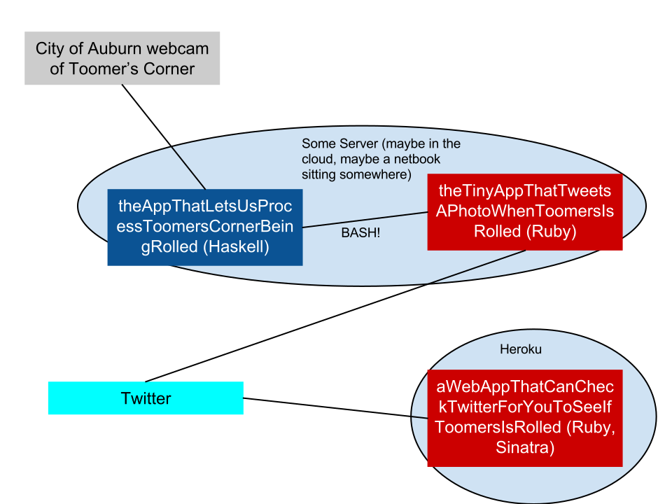

# Is Toomer Corner Being Rolled Right Now?

A [#SmartCityHack](http://www.global.datafest.net/) project rolled by
[Alex](http://github.com/redxaxder),
[Daniel](http://github.com/friedbrice),
[Steven](http://github.com/StevenClontz),
and [Zack!](http://github.com/ZSarver)

Abstract: using a live feed provided by the City of Auburn,
<http://www.auburnalabama.org/mvc/cams/City-Cameras/Toomer's-Corner>,
we can programmatically determine if Auburn Tigers fans have begun
[rolling Toomer's Corner](http://en.wikipedia.org/wiki/Auburn_University_traditions#Toomer.27s_Corner).
This program tweets at
[@IsToomersRolled](https://twitter.com/IsToomersRolled),
which is used by our web app at
<https://istoomerscornerbeingrolled.herokuapp.com/> to display
either "No..." or "Yes!".

## A Picture Is Worth a 1000 Words

